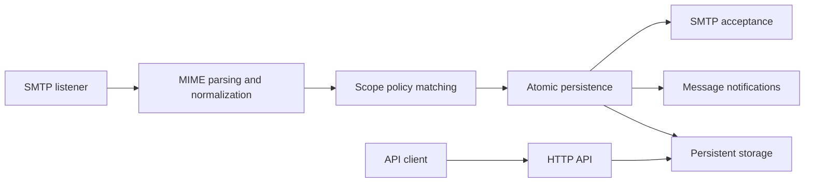

# Architecture

Sand Post is a self-hosted development email catcher. One Rust executable
runs an SMTP listener and an HTTP API. Persistent
storage needs a local SQLite database and a writable data directory; no
external database server, queue, or cache is required.

## Components and boundaries

| Crate | Responsibility | Workspace dependencies |
| --- | --- | --- |
| `sandpost-core` | Domain identifiers, mail facts, scope hierarchy, users, roles, and inboxes | none |
| `sandpost-query` | Typed query language, validation, normalization, and query evaluation | core |
| `sandpost-match` | Immutable policy snapshots, indexed candidates, shared evaluation, and set differences | core, query |
| `sandpost-mail` | SMTP capture, MIME parsing, and mail normalization | core |
| `sandpost-storage` | Persistence, atomic mail writes, scope policies, and materialized visibility | core |
| `sandpost-auth` | Membership visibility, personal restrictions, and inherited administrative permissions | core, query |
| `sandpost-web` | Versioned HTTP API, validation, and events | core, storage |
| `sandpost` | Configuration, storage bootstrap, ingestion orchestration, listeners, and process lifecycle | core, match, mail, storage, web |

Domain and query code are independent of HTTP and persistence. Mail parsing
has no permission rules. Matching computes scope relationships and policy
versions; storage persists those results. Authorization helpers exist as
library primitives, while authentication and API authorization are future work.

The agent documentation describes the system independently of package
Markdown. Keep architecture at the component and flow level. Persistence
contracts and SQLite details belong in [storage](storage.md); query semantics
and visibility rules belong in [query language](query-language.md) and
[scope engine](scope-engine.md).

## Mail ingestion and reads

Mail is parsed and normalized once, then matched against the policy snapshot
loaded at startup. A single stored message can belong to several scopes.
Persistence commits mail and visibility links together before SMTP reports
success or the application broadcasts a notification. A persistence failure
returns a temporary SMTP failure. Transport retries can create separate mail
records; delivery is not exactly once.

The HTTP API reads stored summaries, message details, and original MIME bytes.
Server-sent events announce committed messages and request resynchronization
when subscribers miss updates. Notifications do not provide durable replay.
The HTTP API exposes all captured mail without authentication.

## Runtime and deployment

Tokio runs the listeners and Axum serves HTTP. Matching and database operations
run on the blocking pool. Both listeners bind before readiness is reported;
termination signals or a service failure trigger shutdown with bounded draining.

The executable bundles SQLite and serves only HTTP API routes, so running
it requires no database service or frontend build.

## Current limits and planned work

The service targets local development. SMTP has bounded inputs and sessions,
with no outbound delivery, TLS, or authentication. Authorization primitives
are not login or transport middleware. Scope editing, live policy publication,
and historical reclassification are not exposed application features yet.

Retention, disk attachment storage, full-text search, richer interface features,
and measured performance improvements remain planned work. Add infrastructure
only when the implemented requirements and measurements justify it.
