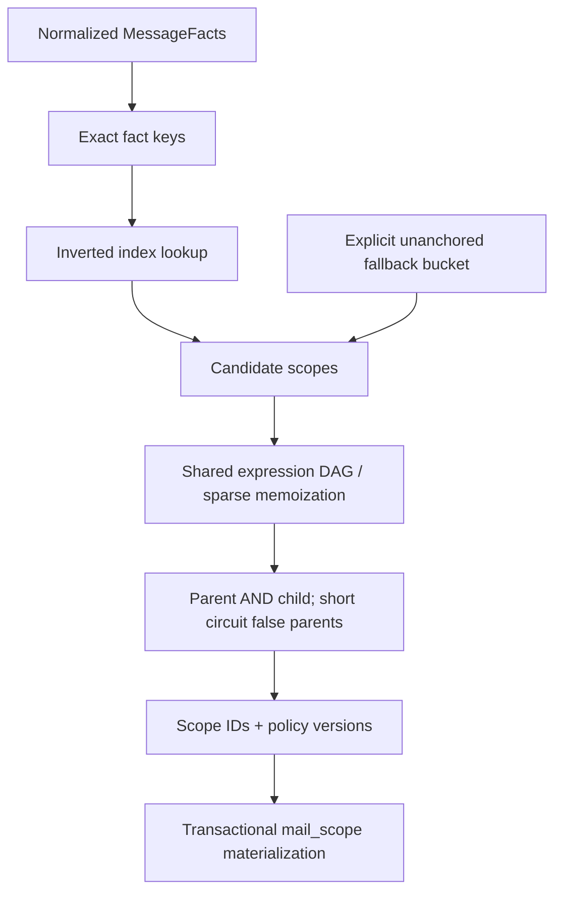

# Scope visibility engine

A scope is a generic tree node, never an organization/team/project type.
Identifiers remain stable across moves; names and order do not affect identity.
The adjacency model provides indexed children, ancestors in O(depth), subtree
preorder in O(subtree size), cycle/missing-parent/depth validation and atomic
in-memory moves. Tree traversals use an explicit stack. Roots have depth zero;
there may be multiple roots. Snapshot construction and validated topology moves
may inspect all configuration nodes; normal ingest does not scan every scope.

## Semantics

```text
effective(child) = effective(parent) AND local(child)
user visibility = (effective(scope A) OR effective(scope B) OR ...)
                  AND optional personal filter
inbox visibility = user visibility AND saved inbox filter
```

Empty local filters are true. A child cannot expand a parent's policy. User
membership can cover several independent branches without copying messages.
Role grants are separate: owner/admin can manage its scope and descendants;
member/viewer only has the mail visibility granted by membership. Unknown scopes
and empty memberships fail closed.

## Candidate selection and shared execution



Each policy receives a safe positive anchor cover: exact address/domain,
header or RFC message-ID predicates. For AND, any required cover is safe, so
the smallest available cover is selected. For OR, every branch must have a
cover; their union is used. NOT and body-only comparisons have no safe positive
anchor, so they use the fallback bucket. A child can reuse an inherited cover
even when its local filter has none. False expressions have an empty cover.

Ingest extracts only the field categories referenced by indexes and looks up
matching keys directly. It visits candidate scopes plus the explicit fallback
bucket. Shared nodes are hash-consed at snapshot build time, and the per-message
memo caches only visited nodes. Identical predicates evaluate once per message.
Effective policies reference parent nodes rather than permanently copying
ancestor ASTs. Evaluation uses an explicit stack, including for deep hierarchies.
Short circuiting a false parent skips descendant local predicates. Cheap cost
hints run before expensive work.

One matcher test configures 1,001 exact-domain scopes and checks that a message
selects two matching scopes and evaluates their shared predicate once. This
asserts the candidate/execution shape; it is not a throughput benchmark.

**Known ceiling:** if every scope uses only an unanchored body/negative filter,
the fallback bucket can include every scope. A catch-all root also legitimately
matches every message. This is an explicit planner limitation, not a hidden
messages-by-scopes scan in the usual indexed path. Later improvements can use
additional necessary predicates, token indexes, parent candidate lists and
set-oriented historical execution. Arbitrary policies cannot always be routed
by positive exact indexes; never invent an anchor that loses possible matches.

## Materialization and versioning

SQLite stores core mail in `mail` and versioned visibility links in
`mail_scope(scope_identifier,mail_sequence,policy_version)`. The full identifier
names distinguish the linked scope and mail sequence. Mailbox and header facts
remain role-aware and ordered in relational child tables. Materialized union
reads deduplicate overlap and accept only links whose version equals the current
scope version. Numeric sequences support future compressed bitmaps and bounded
keyset pagination. Saved inboxes and personal filters are restrictions over
authorized mail, never separate physical mail stores.

`ScopeTree::set_filter` and `move_scope` return the affected subtree and increment
each affected policy version. Unrelated branches keep their versions. Query
validation must succeed before applying a policy mutation. These are domain
building blocks, not an exposed scope editing service. The initial running
binary loads one immutable matcher snapshot at startup; live editing and
historical recomputation are deferred.

The storage replacement primitive guards the expected current version. It can
atomically replace one scope's complete set. `MatchDelta::between` computes:

```text
added   = NEW_SET - OLD_SET
removed = OLD_SET - NEW_SET
```

The first set representation is a sorted set. Roaring-style compressed bitmaps
can replace it when measured cardinality/memory warrants it; no bitmap engine is
claimed today.

## Next policy-publication milestone

1. Validate the proposed subtree topology and every affected effective policy.
2. Persist the subtree version changes transactionally and publish a new
   immutable matcher snapshot with a generation/watermark coordination boundary.
3. Mark older materializations stale; current-version reads fail closed.
4. Reclassify only the affected subtree, starting from prior materializations,
   parent sets and indexed facts. A broadened root with no usable anchor may
   require examining all historical messages in bounded batches; this is a
   legitimate exceptional policy change, not normal ingest behavior.
5. Compute added/removed sets and propagate only those IDs to descendants. Keep
   jobs resumable, version-check commits, and include ingests beyond the job's
   watermark before declaring the new materialization complete.

No background reclassification or delta job scheduler exists yet. In-memory
tree edits alone must not be used to claim a fully updated persistent policy.
FTS, richer candidate indexes and bitmap/DAG optimization require representative
benchmarks and correctness tests before introducing new infrastructure.
